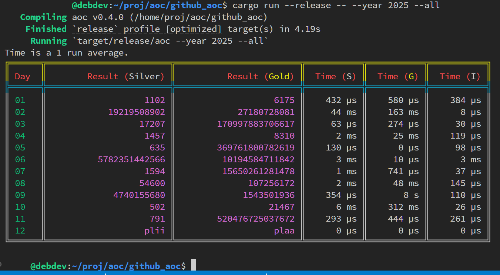

## Advent of Code solutions
https://adventofcode.com/



## Input data:
Grab it from AoC website, save puzzle prompt to:

```
input/2025/real/01.txt
input/2025/test/01.txt
```

etc.

## Commands
Help provided by:
cargo run -- --help

```
Advent of Code solution runner v. 0.4.0
Usage: aoc [OPTIONS]

Options:
  -a, --all              Run all solutions, can not be run at same time with day
  -d, --day <DAY>        [01..24] day of calendar
  -n, --number <NUMBER>  Run N times
  -t, --test             Run with test data instead of real data
  -y, --year <YEAR>      [0000-9999] calendar year
  -h, --help             Print help
  -V, --version          Print version
```

## Command examples
Optimized rust solutions can be run with 
```
cargo run --release -- --year 2025 --day 11
```

Debug without --release
```
cargo run -- --year 2025 --day 11
```

With test data instead of release data:
```
cargo run -- --year 2025 --day 11 --test
```

All solutions for a chosen year:
```
cargo run -- --year 2025 --all
```

## Crates used as of 2025-12-11:
clap = { version = "4.5.53", features = ["derive", "cargo"] }
colored = "3.0.0"
geo = "0.32.0"
good_lp = "1.14.2"
grid = "1.0.0"
itertools = "0.14.0"
lazy_static = "1.5.0"
libm = "0.2.15"
ndarray = "0.17.1"
num-integer = "0.1.46"
ordered-float = "5.1.0"
pathfinding = "4.14.0"
petgraph = "0.8.3"
rayon = "1.11.0"
regex = "1.12.2"